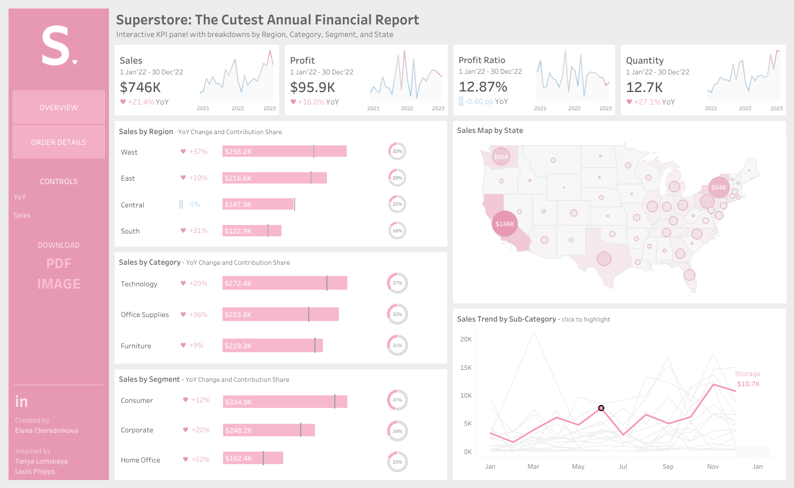

# Data Visualization

## Assignment 2: Good and Bad Data Visualization

### Requirements:

- Data visualizations are important tools for communication and convincing; we need to be able to evaluate the ways that data are presented in visual form to be critical consumers of information 
- To test your evaluation skills, locate two public data visualizations online, one good and one bad  
    - You can find data visualizations at https://public.tableau.com/app/discover or https://datavizproject.com/, or anywhere else you like! 
- For each visualization (good and bad):  
    - Explain (with reference to material covered up to date, along with readings and other scholarly sources, as needed) why you classified that visualization the way you did.
      
    1. Good Example: The Cutest Annual Financial Report (https://public.tableau.com/views/TheCutestAnnualFinancialReport/Cutereview?:language=en-US&:sid=&:redirect=auth&:display_count=n&:origin=viz_share_link)
    

    The selected visualization is a good example of effective dashboard design because it satisfies all key qualities of a good data visualization. 

    Aesthetic: The dashboard is visually appealing and well-structured, with a clear visual hierarchy that highlights key performance indicators at the top and progressively moves toward more granular detail. The use of whitespace prevents visual clutter and improves readability. The color palette is largely monochromatic, which creates visual consistency and makes the dashboard suitable for printing, although reliance on a single color may slightly limit contrast for accessibility. Titles and subtitles are concise and descriptive, guiding the user clearly through the content. The combination of bar charts, line charts, KPI cards, and a geographic map enables both high-level overview and detailed analysis within a single interface. 

    Substantive: The financial data is presented in a clear, intuitively readable layout to support analysis and comparison. All KPIs are prominently displayed, and charts include appropriate data labels, units, and annotations to minimize ambiguity. The “Order Details” tab provides additional information in a tabular format in case the users want to drill down for detailed analysis. The dashboard can be downloaded in multiple commonly used formats which enhances its reusability.

    Perceptual: The visualizations and underlying data in the dashboard present a clear snapshot of the financial report. The use of clear, concise, and meaningful data points, visualizations, and labels make it easier to read and comprehend the visualization. It balances simplicity with depth thus serving a diverse range of audience, from high-level senior management users to more detailed information at the region, state, category, and segment level. Overall, the design is easier to comprehend and supports informed decision making.


     
    - How could this data visualization have been improved?  
    
    2. Bad Visualization (https://public.tableau.com/views/really_bad_visualizations/Sheet5?:language=en-US&:sid=&:redirect=auth&:display_count=n&:origin=viz_share_link)
    
    
    The visualization selected is an example of bad visualization for a number of reaons listed down belo.

    Aesthetic: There is excessive plotting of overlapping lines creating a dense spaghetti effect and makes readability difficult. The chart is visually cluttered and overwhelming. Colors appear to be randomly assigned and repeating, hence a lack of visual hierarchy for the user to start reading from. There is no visual emphasis on key points, trends, or patterns. The chart also lacks a meaningful title, subtitle and/or contextual annotations which reduces the visual clarity and makes the presentation less professional. The selection of so many colors mean it is not monochrome print friendly (although it doesn't make sense even on a color printout.)

    Substantive: There are so many data points but without aggregation, categorization, or any meaningful explanation, it does not support any meaningful analysis. There is no mention of the purpose of this visualization, and there is no legend to explain what each line/color represents - although adding a legend for such a large number of categories would make this visualization worse in its current type and form. It appears more of a data dump than a visual to support analysis or decision making.

    Perceptual: Due to lack of visual hierarchy, and the points mentioned above, the visualization places huge cognitive burden on the reader. The story and messaging are not clear, and it overwhelms the reader visually by presenting such a large amount of data without any structure or communication strategy. The visualization does not satisfy any perceptual purpose.


    How to improve: 
    1. Aggregate the data into meaningful categories to reduce number of displayed series or show key series and allow interaction to explore details
    2. User purposeful color coding, limit the color palette and tie it to specified categories or neutral color schemes. 
    3. Use clear and meaningful chart title, subtitle, data labels, and legend to add context and meaning to the data, and support visual hierarchy and readability. This will also provide a clear analytical objective for the user to understand and follow through the visuals.
    4. Depending on the data consolidation, a different chart type could also be used or the data could be broken down into smaller sub-categories illustrated through multiple charts. This will reduce clutter and serve a wider range of audience looking for high-level or more detailed information.
    5. In case the data cannot be broken down into sub-categories, then the use of an interactive visualization tool such a Tableau can make the data illustration more readable, and allow user to drill-up or drill-down.


      
      ```
- Word count should not exceed (as a maximum) 500 words for each visualization (i.e. 
300 words for your good example and 500 for your bad example)

### Why am I doing this assignment?:

- This assignment ensures active participation in the course, and assesses the learning outcomes
* Apply general design principles to create accessible and equitable data visualizations
* Use data visualization to tell a story

### Rubric:

| Component               | Scoring   | Requirement                                                 |
|-------------------------|-----------|-------------------------------------------------------------|
| Data viz classification and justification | Complete/Incomplete | - Data viz are clearly classified as good or bad<br />- At least three reasons for each classification are provided<br />- Reasoning is supported by course content or scholarly sources |
| Suggested improvements  | Complete/Incomplete | - At least two suggestions for improvement<br />- Suggestions are supported by course content or scholarly sources |

## Submission Information

🚨 **Please review our [Assignment Submission Guide](https://github.com/UofT-DSI/onboarding/blob/main/onboarding_documents/submissions.md)** 🚨 for detailed instructions on how to format, branch, and submit your work. Following these guidelines is crucial for your submissions to be evaluated correctly.

### Submission Parameters:
* Submission Due Date: `23:59 - 02/16/2026`
* The branch name for your repo should be: `assignment-2`
* What to submit for this assignment:
    * This markdown file (assignment_2.md) should be populated and should be the only change in your pull request.
* What the pull request link should look like for this assignment: `https://github.com/<your_github_username>/visualization/pull/<pr_id>`
    * Open a private window in your browser. Copy and paste the link to your pull request into the address bar. Make sure you can see your pull request properly. This helps the technical facilitator and learning support staff review your submission easily.

Checklist:
- [ ] Create a branch called `assignment-2`.
- [ ] Ensure that the repository is public.
- [ ] Review [the PR description guidelines](https://github.com/UofT-DSI/onboarding/blob/main/onboarding_documents/submissions.md#guidelines-for-pull-request-descriptions) and adhere to them.
- [ ] Verify that the link is accessible in a private browser window.

If you encounter any difficulties or have questions, please don't hesitate to reach out to our team via our Slack. Our Technical Facilitators and Learning Support staff are here to help you navigate any challenges.
